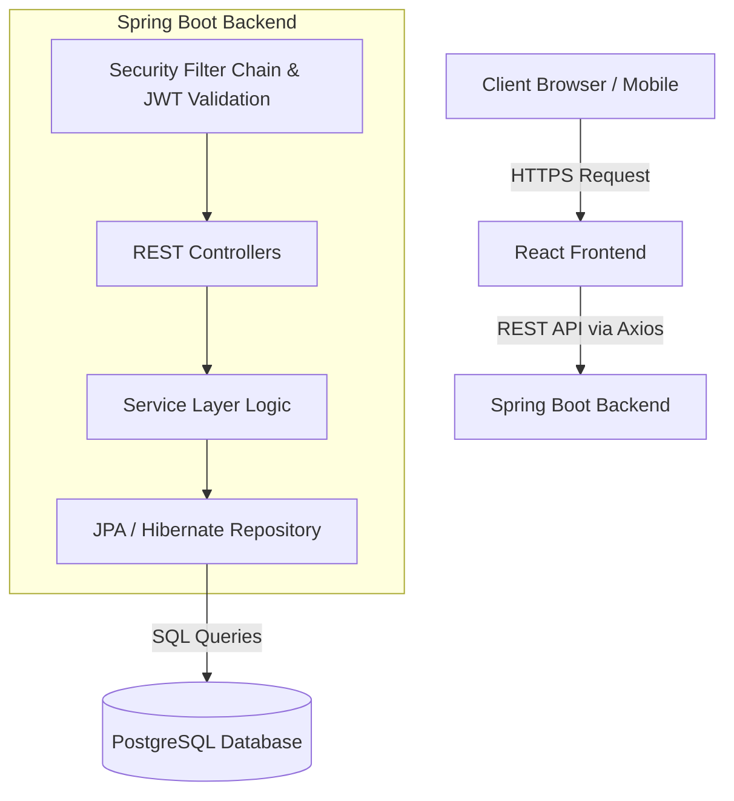

<div align="center">
  <h1>🌱 Momentum</h1>
  <p><b>Small Habits. Lasting Momentum.</b></p>
  
  [](#)
  [](#)
  [](#)
  [](#)

  <br />
  
  
</div>

<br />

## 📚 Table of Contents
- [Project Overview](#-project-overview)
- [Why this project?](#-why-this-project)
- [Key Highlights](#-key-highlights)
- [Demo](#-demo)
- [Screenshots](#-screenshots)
- [Technology Stack](#-technology-stack)
- [Architecture](#-architecture)
- [Folder Structure](#-folder-structure)
- [Installation](#-installation)
- [Environment Variables](#-environment-variables)
- [API Documentation](#-api-documentation)
- [Security](#-security)
- [Deployment](#-deployment)
- [Future Roadmap](#-future-roadmap)
- [Lessons Learned](#-lessons-learned)
- [Contributing](#-contributing)
- [License](#-license)
- [Acknowledgements](#-acknowledgements)

---

## 📖 Project Overview

Normal habit trackers often feel like glorified to-do lists, leading to burnout or a lack of motivation. **Momentum** changes this by introducing gamification, streaks, and visual consistency maps. 

The goal? To give you a hit of excitement and motivation every single day you complete your tasks. Whether you're a student trying to build a study routine or a working professional managing a busy lifestyle, Momentum makes tracking everyday habits beautiful, simple, and incredibly rewarding.

---

## 🎯 Why this project? (Design Philosophy)

Momentum was built on the philosophy that **consistency is driven by visual reward and calm interfaces**. We chose a soft color palette to reduce anxiety around tasks, paired with highly motivating tracking mechanisms:

- **Streaks:** Taking inspiration from Duolingo, building a streak taps into loss aversion—you won't want to break your chain.
- **Heatmaps:** Inspired by GitHub's contribution graph, the consistency map provides an immediate, macro-level view of your discipline over time.
- **Minimalism:** We aggressively cut out complex settings, ensuring you spend time *doing* your habits rather than *configuring* them.

---

## 🏆 Key Highlights

- 🧠 **Mo - The AI Coach:** An intelligent companion that analyzes your weekly progress and provides personalized motivational insights and reflections based on your unique habit patterns.
- 🔥 **Visual Streaks:** See exactly how many days in a row you've kept your momentum alive.
- 📊 **Consistency Heatmap:** A visual grid showing your completion rates over time.
- 📱 **Mobile-First Responsive Design:** A fully fluid design that feels like a native app on screens as small as 320px.
- ✨ **Smooth Animations:** High-quality, satisfying UI animations powered by Framer Motion.
- 🔐 **Authentication:** Secure user accounts via JSON Web Tokens (JWT) and Spring Security.

---

## 🎥 Demo

<div align="center">
  
</div>

---

## 📸 Screenshots

| Login | Register |
|-------|----------|
|  |  |

| Main Dashboard | Add Habit Modal |
|-------|----------|
|  |  |

| AI Coach (Mo) | Consistency Heatmap |
|-------|----------|
|  |  |

| Profile & Settings | Mobile View |
|-------|----------|
|  |  |

---

## 🛠️ Technology Stack

### Frontend (Vercel)
- **Framework:** React 19 + Vite
- **Styling:** Tailwind CSS v4
- **Animations:** Framer Motion
- **Icons:** Lucide React
- **Charts:** Recharts

### Backend (Render)
- **Language:** Java 21
- **Framework:** Spring Boot 4.1.0
- **Security:** Spring Security + JWT (jjwt)
- **Database Access:** Spring Data JPA
- **Database:** PostgreSQL

---

## 🏗️ Architecture

Below is the high-level system design outlining the request flow from the client to the database.



---

## 📁 Folder Structure

The repository is structured as a monorepo containing both the frontend client and the backend server.

```text
momentum-workspace/
├── momentum-backend/         # Spring Boot Java application
│   ├── src/main/java/...
│   │   ├── config/           # CORS & Security configs
│   │   ├── controller/       # REST API endpoints
│   │   ├── model/            # JPA Entities
│   │   ├── repository/       # Database interfaces
│   │   ├── security/         # JWT Filters
│   │   └── service/          # Business logic
│   └── pom.xml               
│
└── momentum-frontend/        # React + Vite application
    ├── src/
    │   ├── components/       # Reusable UI (HabitCards, Modals)
    │   ├── context/          # React Context (UserContext)
    │   ├── pages/            # Main views (Dashboard, Auth, Settings)
    │   └── utils/            # API wrappers (fetchAuth)
    └── package.json          
```

---

## 💻 Installation

### Prerequisites
- Node.js (v18+)
- Java 21
- Maven
- PostgreSQL

### 1. Database Setup
Create a PostgreSQL database named `momentum_db`:
```sql
CREATE DATABASE momentum_db;
```

### 2. Backend Setup
Navigate to the backend directory, configure your database credentials, and run the server.
```bash
cd momentum-backend
mvn spring-boot:run
```

### 3. Frontend Setup
In a new terminal, navigate to the frontend directory, install dependencies, and start the development server.
```bash
cd momentum-frontend
npm install
npm run dev
```

---

## 🔐 Environment Variables

| Variable | Description |
|----------|-------------|
| `VITE_API_URL` | Backend API URL (Frontend) |
| `spring.datasource.url` | PostgreSQL connection string (Backend) |
| `spring.datasource.username` | Database username (Backend) |
| `spring.datasource.password` | Database password (Backend) |
| `jwt.secret` | JWT signing key (Backend) |

---

## 📡 API Documentation

All secured endpoints require an `Authorization` header formatted as: `Bearer <token>`

| Method | Endpoint | Description |
|--------|----------|-------------|
| POST | `/api/auth/register` | Register a new user |
| POST | `/api/auth/login` | Authenticate and receive JWT |
| GET | `/api/habits` | Get all habits |
| POST | `/api/habits` | Create habit |
| PUT | `/api/habits/{id}/toggle` | Toggle completion |
| DELETE | `/api/habits/{id}` | Delete habit |

---

## 🛡️ Security

- **Password Hashing:** Passwords are encrypted using BCrypt.
- **Authentication:** Stateless JSON Web Tokens (JWT).
- **Authorization:** Spring Security protects all non-auth endpoints.
- **CORS:** Configured to explicitly allow specific domains and localhost.

---

## 🌍 Deployment

- **Frontend:** Hosted on [Vercel](https://vercel.com).
- **Backend:** Hosted on [Render](https://render.com).
- **Database:** Hosted on Render PostgreSQL.

---

## 🚀 Future Roadmap

- [ ] Push Notifications for habit reminders.
- [ ] Weekly progress recap emails sent via SendGrid.
- [ ] Dark Mode toggle (currently utilizes soft whites/purples).
- [ ] Social features: Invite friends and view their streaks.

---

## 🧠 Lessons Learned

Building Momentum was a significant learning experience. Some key takeaways include:
- **State Management:** Abstracting the JWT authentication into a unified `UserContext` greatly simplified the frontend component logic.
- **Responsive Design:** Using a mobile-first approach rather than tacking on mobile styles at the end resulted in a much cleaner and more robust CSS structure.
- **CORS & Deployment:** Navigating the complexities of deploying a decoupled architecture (Vercel + Render) required strict environment variable management and CORS policies.

---

## 🤝 Contributing

Contributions are always welcome!
1. Fork the Project
2. Create your Feature Branch (`git checkout -b feature/AmazingFeature`)
3. Commit your Changes (`git commit -m 'Add some AmazingFeature'`)
4. Push to the Branch (`git push origin feature/AmazingFeature`)
5. Open a Pull Request

---

## 📄 License

Distributed under the MIT License. See `LICENSE` for more information.

---

## 🙏 Acknowledgements

- Inspiration drawn from [Duolingo](https://www.duolingo.com/) for gamification and streaks.
- Consistency map inspired by [GitHub](https://github.com/).
- UI aesthetics influenced by [Headspace](https://www.headspace.com/).

---

<div align="center">
  <b>Built with ❤️ by Sarva</b>
</div>
